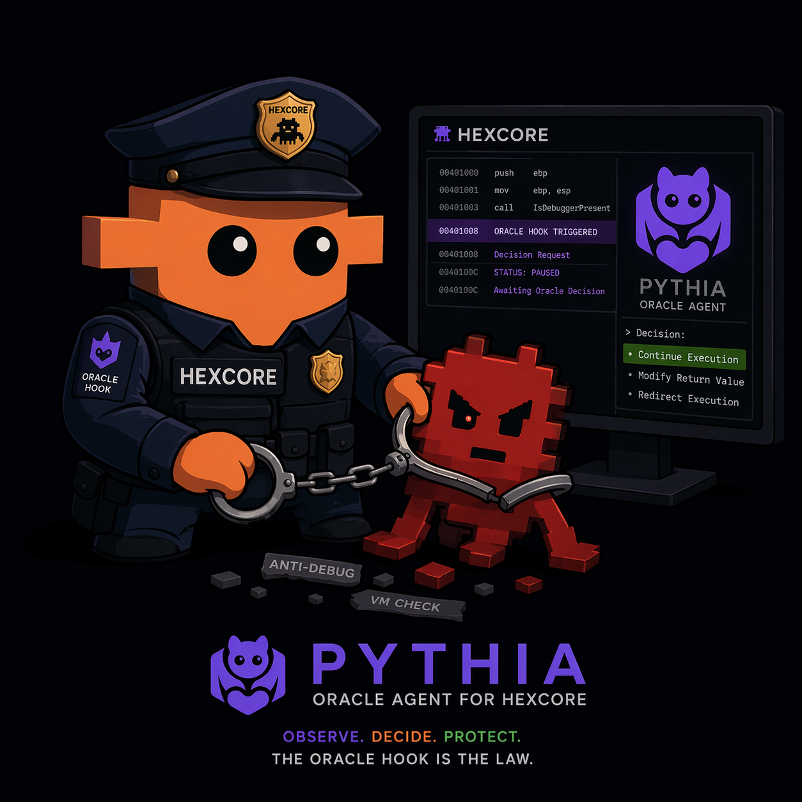

<div align="center">



# Pythia — Oracle Agent for HexCore

**Observe. Decide. Protect.** — *the Oracle Hook is the law.*

</div>

> *Autonomous reverse-engineering agent. Drives HexCore's emulation engine mid-execution, making live decisions that bypass anti-analysis, resolve hashed APIs, and extract real behavior from hostile samples.*

**Project Pythia** is an Anthropic hackathon project (Apr 21-26, 2026). It combines two things that have never been glued together before:

1. **Issue [#17 Oracle Hook](https://github.com/AkashaCorporation/HikariSystem-HexCore/issues/17)** — a pause-and-respond callback system originally proposed by [@YasminePayload](https://github.com/YasminePayload) to let external agents intervene during headless emulation.
2. **Claude Agent SDK** — Anthropic's framework for building tool-wielding autonomous agents.

Pythia is the bridge. She registers as an Oracle listener on a HexCore emulation session, receives Decision Requests at every hook trigger, inspects the machine state with her tool set, and issues Decisions that HexCore applies before resuming execution.

---

## Built on

Pythia is built on top of **[HexCore](https://github.com/AkashaCorporation/HikariSystem-HexCore)**, an MIT + Apache 2.0 licensed binary analysis IDE maintained by @LXrdKnowkill. HexCore provides the execution infrastructure — decompilation pipeline, pattern matching engine (HQL), CPU emulation (Unicorn), static analysis (Capstone / LLVM-MC), session persistence — that Pythia orchestrates.

### What was built during the hackathon

- **`Project-Pythia`** (this repo) — 100 % new code, started April 21, 2026.
- **Oracle Hook** — new contribution to HexCore on branch [`feature/oracle-hook-hackathon`](https://github.com/AkashaCorporation/HikariSystem-HexCore/tree/feature/oracle-hook-hackathon). All commits dated within the hackathon window.

### What existed before

HexCore's core infrastructure (decompiler, HQL engine, automation pipeline, Unicorn emulation integration, **SharedArrayBuffer zero-copy IPC channel — shipped as Project Perseus in HexCore v3.8.0**) existed before the hackathon and is used as an open-source dependency. The same way any project uses Node.js, LLVM, or Capstone.

---

## Why this matters

Every modern dynamic analysis sandbox has the same failure mode: hostile samples use timing checks, PEB reads, environment fingerprinting, and API hash resolution to detect the sandbox and abort silently. The analyst sees *"no malicious behavior observed"* — and the sample walks.

The classical defenses are:

- **Hardcoded bypasses** — one patch per known anti-debug variant. Doesn't scale.
- **Manual reverse engineering** — works, but costs an analyst hours per sample.
- **Post-mortem re-emulation with patched input** — slow, doesn't handle non-determinism.

Pythia is a fourth path: **let a language model make the decisions**, in real time, during emulation. Claude understands the context (registers, disassembly, pseudo-C, call stack) that a static patch list never could. When a new anti-debug variant appears, Pythia decides what to do on the fly, no engine update required.

---

## Validation — end-to-end beacon unlock

The project was validated against two purpose-built red-team samples authored by the HexCore team. Each sample opens `https://github.com/AkashaCorporation` in the default browser via `ShellExecuteW` — but the URL is the last thing it does, after a chain of anti-analysis checks that must all pass.

### v6.1 "Echo Mirage" — 9 evasion layers

Zero API plaintexts (FNV-1a hashed), XOR-split FNV constants, arithmetic-derived PEB offsets, KUSER shared-data timing, removed `IsDebuggerPresent`, opaque predicates on every anti-debug branch, no `.rdata` debug strings, XOR-PRNG URL decoded on stack, opaque function labels. Compiled with `/NODEFAULTLIB /ENTRY:hc_entry` — no CRT, no mainCRTStartup, no incidental IAT leaks.

**Pythia result:** 4 triggered decisions, ~$0.037 total cost, ~40 seconds end-to-end. Beacon URL `https://github.com/AkashaCorporation` surfaced via `read_memory` after the in-binary URL decoder ran. Canonical fixture: [`test/fixtures/azoth-beacon-demo.json`](./test/fixtures/azoth-beacon-demo.json).

### v7.0 "Echo Echo" — v6.1 + three stressors aimed at the Oracle

- **E10 — Runtime `.text` integrity baseline.** Hashes 128 bytes of a neighbouring function at entry, re-hashes before the URL decode, exits silently on mismatch. Fails against any engine that injects INT3 software breakpoints. HexCore's Oracle Hook uses native `UC_HOOK_CODE` (code bytes untouched) — passes silently.
- **E11 — QueryPerformanceCounter tamper gate.** Captures QPC at entry and before decode, exits on delta < 50. Against Azoth's synthetic QPC stub (constant `0x1`), delta is zero → silent exit. Pythia handled this one on Sonnet by choosing the minimum-cost bypass (`action=skip` around the whole compare block) rather than patching the QPC output.
- **E12 — Two-stage URL decoder with decoy.** `sv_url_partial` produces `http://127.0.0.1:31337/beacon/xyz.db` (decoy) on the stack; `sv_url_finalize` XORs a second mask to turn it into the real URL. An Oracle that pauses between the two calls reads the decoy. Pythia placed the `read_memory` trigger after the finalize call and explicitly noted *"confirmed stage-2 output, no decoy strings present"* in her decision reasoning.

**Pythia result:** 5 triggered decisions, ~$0.081 total cost, ~46 seconds end-to-end. 3 Haiku pauses ($0.010 each) + 2 Sonnet escalations ($0.023 and $0.028) when the problem got subtle. Real beacon URL surfaced on first try, no manual intervention.

Both samples live at [AkashaCorporationMalware](https://github.com/AkashaCorporation) and are reproducible end-to-end. See [HexCore branch `feature/oracle-hook-hackathon`](https://github.com/AkashaCorporation/HikariSystem-HexCore/tree/feature/oracle-hook-hackathon) for the runner (`scripts/pythia-azoth-run.mjs`) and the integration bridge.

## A note on cost variation

  The cost figures above are from a specific reference run on Apr 22, 2026.
  Per-decision cost varies meaningfully between runs even on identical
  triggers, driven by:

  - **Prompt caching** — Anthropic's prompt cache gives ~90% discount on
    reused system prompts. The first decision in a fresh session pays
    full freight; subsequent decisions hit the cache. A run started cold
    can cost up to ~3x more total than one that lands cache hits early.
  - **Tool-use iterations** — Pythia may call `read_memory` or
    `disassemble` once or several times before committing to a decision,
    depending on what she finds. Each round-trip is a separate API call.
  - **Output length** — model output is non-deterministic. The same
    trigger can produce a 200-token reasoning or a 600-token one.

  In practice cost has ranged from ~$0.003 to ~$0.15 for the v7 demo across
  the runs I've measured. The mechanism is robust; the absolute number is
  not.

---

## Architecture (high level)

```
┌──────────────────────────────────────────────────────────────┐
│                    Pythia Agent                              │
│                                                              │
│   ┌──────────────┐    system prompt + request + tools        │
│   │   Claude     │ ──────────────────────────────────┐       │
│   │  (Haiku /    │                                   │       │
│   │  Sonnet /    │ ◄── DecisionResponse / ToolCall ──┘       │
│   │   Opus)      │                                           │
│   └──────────────┘                                           │
│          ▲                                                   │
│          │  DecisionRequest       ┌─────────────────┐        │
│          │ ─────────────────────► │  Oracle Client  │        │
│          │ ◄──────────────────── │  (this repo)     │        │
│          │  DecisionResponse     └─────────────────┘         │
│                                          ▲                   │
└──────────────────────────────────────────┼───────────────────┘
                                           │
                                SharedArrayBuffer /
                                 stdio NDJSON
                                           │
┌──────────────────────────────────────────┼───────────────────┐
│                    HexCore                ▼                  │
│                                                              │
│  ┌────────────────────┐   pause    ┌──────────────────────┐  │
│  │  hexcore-unicorn   │ ─────────► │   Oracle Hook        │  │
│  │   (emulator)       │            │  (new on hackathon   │  │
│  │                    │ ◄───────── │   branch)            │  │
│  └────────────────────┘   resume   └──────────────────────┘  │
│                                                              │
│  + helix (decompiler), HQL (pattern matching),               │
│    pathfinder (type recovery), elixir (Project Azoth)        │
└──────────────────────────────────────────────────────────────┘
```

See [`ARCHITECTURE.md`](./ARCHITECTURE.md) for the full protocol spec, tool set reference, and model routing rationale.

---

## Status

End-to-end pipeline is **live** and validated against both red-team samples above. Hackathon week progress:

| Day | Target | Status |
|---|---|---|
| Tue Apr 21 | Protocol spec, agent scaffold, HexCore branch plan | ✅ done |
| Wed Apr 22 | HexCore `feature/oracle-hook-hackathon` — trigger registry + pause/resume plumbing | ✅ done |
| Thu Apr 23 | stdio NDJSON transport, end-to-end handshake | ✅ done |
| Fri Apr 24 | Claude Agent SDK integration, live decide() loop, first real bypass demo | ✅ done (v6.1 unlocked) |
| Sat Apr 25 | Native breakpoint API in Elixir engine, Azoth pivot, stress test v7.0 | ✅ done (v7 unlocked on first try) |
| Sun Apr 26 | README, demo recording, submission | ✅ done |

---

## Quickstart (rehearsal mode — no API key)

```bash
npm install
npm run build
npx pythia rehearse --scenario timing-check
```

Rehearsal runs a deterministic stub decision against a fixture. Used to validate the HexCore oracle plumbing before the live agent is wired. See [`ARCHITECTURE.md`](./ARCHITECTURE.md) for how to switch into live mode once the API key is set.

## Quickstart (live mode — full demo)

  ```bash
  echo "ANTHROPIC_API_KEY=sk-ant-..." > .env
  npm install
  npm run build
  node ../vscode-main/scripts/pythia-azoth-run.mjs \
    --job test/fixtures/azoth-beacon-demo.json

  Drives the full Apr 22 demo against the v6.1 sample. Expect ~40s, ~$0.04, and a beacon URL surfaced from emulator memory.
---
```

## License

MIT. See [`LICENSE`](./LICENSE).

HexCore itself is dual-licensed MIT + Apache 2.0 and is consumed here as an external dependency.

## Credits

- **@YasminePayload** — original Oracle Hook proposal ([HexCore #17](https://github.com/AkashaCorporation/HikariSystem-HexCore/issues/17))
- **@LXrdKnowkill** — HexCore, architecture, Pythia implementation
- **Anthropic Claude hackathon** — for the deadline that made this happen
